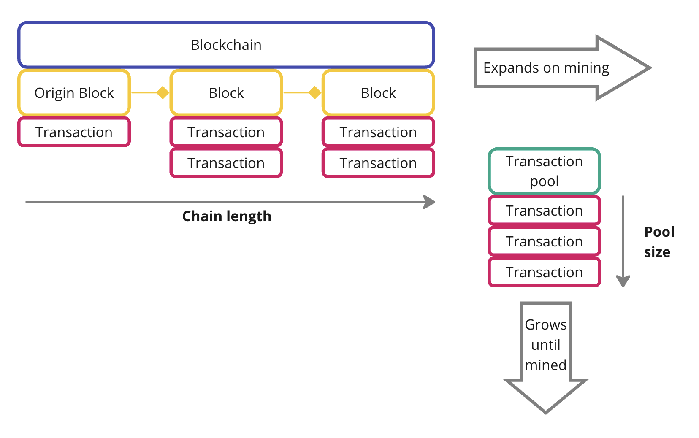
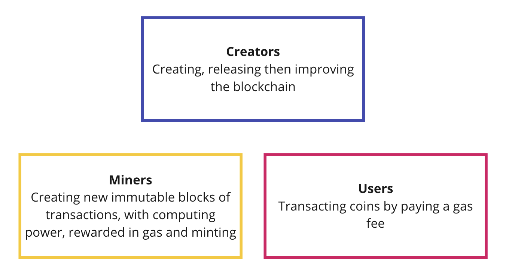
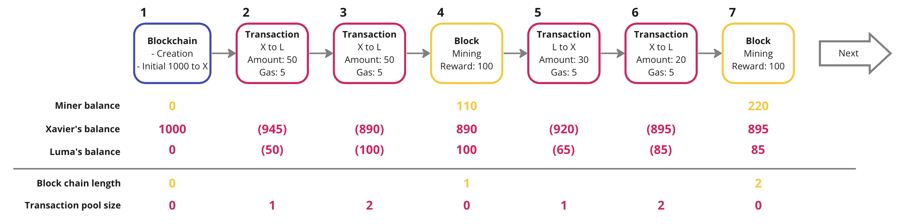

# Simple TypeScript Blockchain

## Introduction

This project is for personal educational purposes. My objective is to build a mental mapping of a blockchain's design.
I leverage different online resources to progressively build-up a more complete blockchain.

## Start

-   Install dependencies: `yarn`
-   Launch the transactions simulation: `npx ts-node index.ts`

## Design

### Representation of the chain

### Roles involved in the chain lifecycle

### A basic example of chain events

### Security

#### Transaction validity

Each wallet owner owns a key pair as unique identifier, address, transaction signing tool. The public key is accessible to the network. The private remains secret to ensure the authenticity.

#### Blockchain validity through Proof of work

Blocks are chained via their hashes. If a previous block hash is changed, it invalidates all subsequent hashes. It will take more time for a solo hacker to re-mine each subsequent block hashes to build a fake chain, than the rest of the network to continue growing the valid chain.

## Todo

-   Basic chain operations -> Setup a peer-to-peer process:
    -   Handle concurrency
    -   Build a proper secure API: what can be called by who
    -   Sync chain and transaction pools history across the network
-   Security:
    -   Ensure validity of chain, block and transactions
    -   Get a more consistant mining time (currently using a basic difficulty setting and refresh)
-   Global economics:
    -   Draft a rational behind initial coin quantity then growth (minting and burning)
-   Improve the transaction engraving:
    -   Set a minimum gas allowed per transaction
    -   And/or a set time before transaction failed
    -   If too many transactions, let the miner pick and choose transactions, for instance based on gas
-   Performance
    -   Create reliable intermediary images of the ledger, instead of recalculating balances through the entire history
-   Blockchain value
    -   Explore contract execution like Ethereum
-   Code robustness
    -   Add tests, unit to end-to-end

## Sources

[Creating a blockchain in 60 lines of Javascript - by FreakCdev](https://dev.to/freakcdev297/creating-a-blockchain-in-60-lines-of-javascript-5fka)

### To explore

-   https://medium.com/coinmonks/building-a-blockchain-using-javascript-ac75d1b2af23
-   https://github.com/nambrot/blockchain-in-js
-   https://www.youtube.com/watch?v=zVqczFZr124&ab_channel=SimplyExplained
